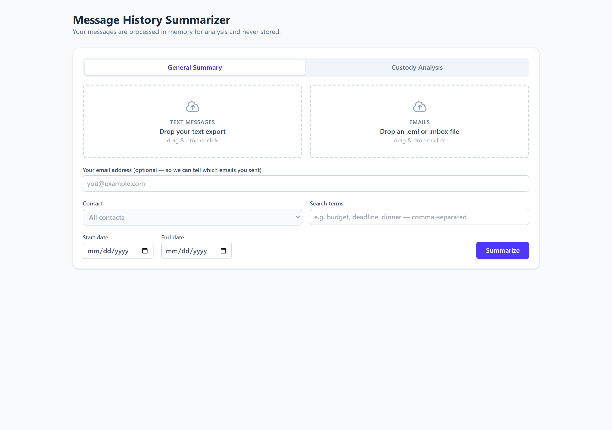
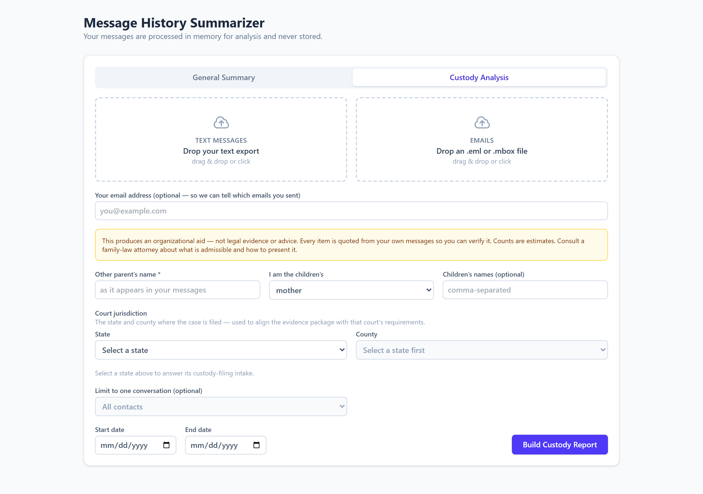
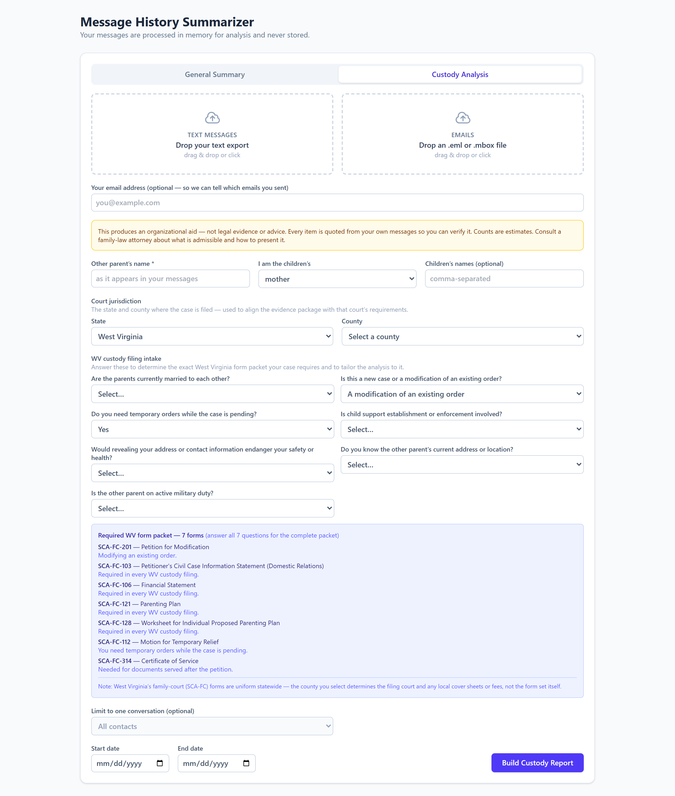
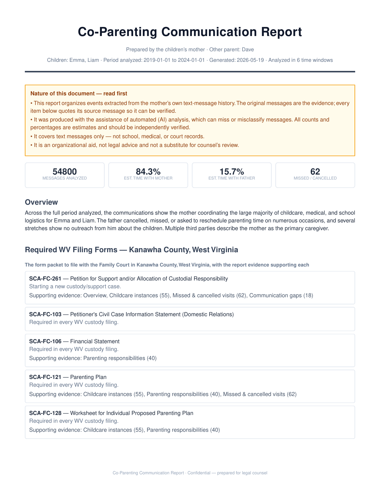
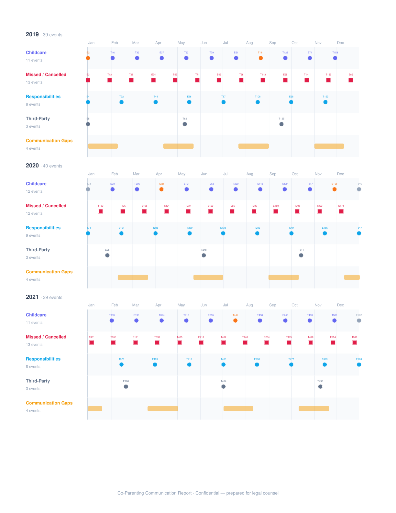
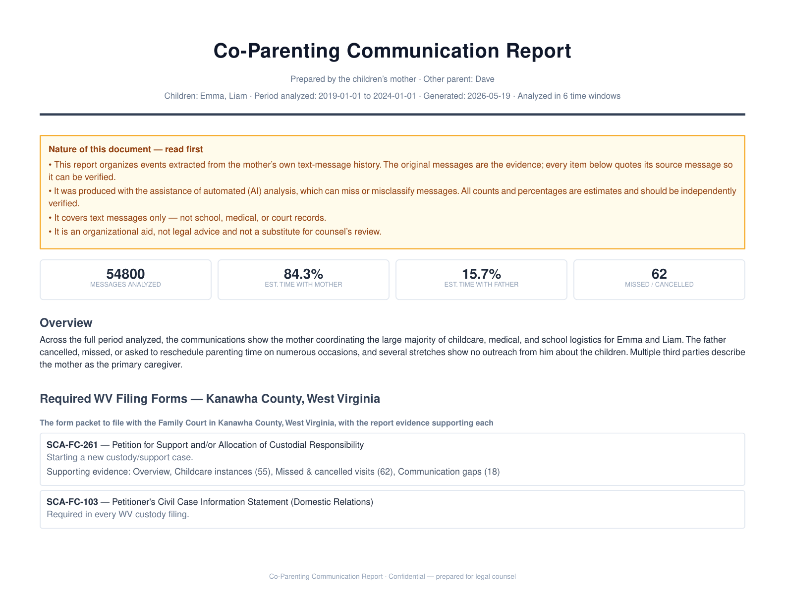
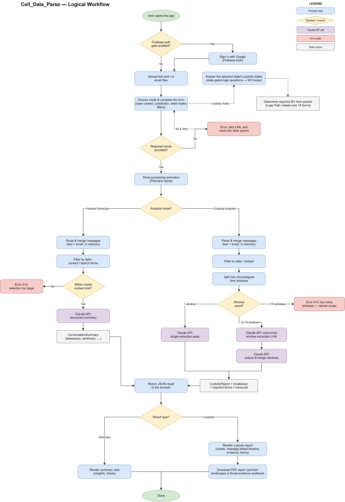
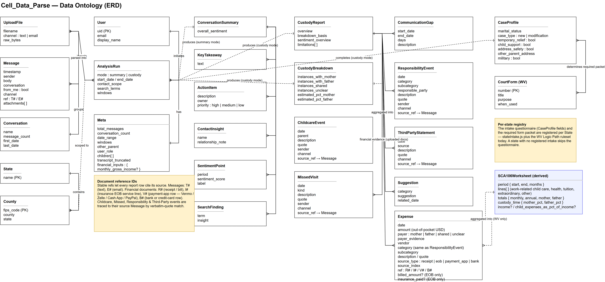

# Cell_Phone_Data_Parse

> Local-first, browser-based custody-case builder. Drop your text and email exports in, get back an organized timeline, a custody breakdown, the required filing-form packet for your jurisdiction, and downloadable PDF + Excel evidence reports — powered by Claude.

## What it does

The app reads a parent's own text-message and email history with the other parent and turns it into a court-ready picture of:

- **Custody split** — who actually had the children, by month
- **Missed & cancelled visits** — every cancellation, no-show, and reschedule
- **Communication gaps** — stretches where the other parent went quiet
- **Parenting responsibilities** — who handled school, medical, activities, etc.
- **Third-party statements** — what others (teachers, family, doctors) observed
- **A swim-lane timeline** with each marker linked back to its source message via a stable ID (`T1`, `T2`… for texts, `E1`, `E2`… for emails)

Every claim is quoted from the source message, so it can be independently verified. The output is an organizational aid for legal counsel — not legal advice.

## Modes

| Mode | Use |
|------|-----|
| **General Summary** | Overall insights about any message thread (key takeaways, action items, sentiment, contacts) |
| **Custody Analysis** | The full evidence build, with a state-driven intake that determines the required form packet and tailors the analysis to your case |

## Screenshots

### General Summary
The landing tab — drop a text export and/or `.mbox`/`.eml` file, optionally narrow by contact, search terms, or date range, and click **Summarize**.



### Custody Analysis — initial state
The intake is hidden until a jurisdiction with a registered intake is selected, so the form is short until it needs to expand.



### Custody Analysis — West Virginia intake
Picking **West Virginia** reveals the 7-question case profile. As answers come in, the required WV form packet (SCA-FC forms) is computed live below the questions.



## Sample reports

The same analysis renders to a court-ready PDF and a multi-tab Excel evidence workbook. Both ship with sample outputs in [`sample-reports/`](sample-reports/) so the layout can be reviewed without running the pipeline.

### PDF — page 1
Header, disclaimer, headline stats, narrative overview, and the required form packet scoped to the filing county.



### PDF — event timeline
One chart per calendar year, month gridlines for seasonal patterns, square markers for missed/cancelled visits, amber bars for communication gaps. The small ID above each marker (`T#` / `E#`) traces back to the exact message in the Appendix.



### PDF — landscape variant
A wider page that gives the timeline more horizontal room. Generated by [`CustodyReportPDFLandscape`](frontend/src/CustodyReportPDFLandscape.jsx) for readability comparison.



### Files in `sample-reports/`
| File | Volume |
|------|--------|
| `custody-report-3yr.pdf` / `.xlsx` | 600 messages · 96 events |
| `custody-report-5yr.pdf` / `.xlsx` | 1,300 messages · 189 events |
| `custody-report-7yr-max.pdf` / `.xlsx` | 2,000 messages · 374 events |

Each PDF has a matching `-landscape.pdf` for the wide layout. The Excel workbook contains 17 tabs — Summary, the required form packet, each evidence category, per-court-category responsibility breakouts, a chronological Timeline, and the full Message Log with ref IDs.

## Architecture

Two pages live in [`Architecture/architecture.drawio`](Architecture/architecture.drawio) (open with the [draw.io](https://www.drawio.com/) desktop app or VS Code extension):

### Logical workflow


### Data ontology (ERD)


## How to use it (end user)

1. **Export your messages.** iMessage: an iPhone backup tool that exports a JSON or text dump per conversation. Email: a `.mbox` from Gmail Takeout, or one or more `.eml` files.
2. **Open the app.** Drop the text export into the **Text Messages** zone and the email file into the **Emails** zone. Both are optional — one is enough.
3. **Pick a mode.** *General Summary* for a topic-agnostic overview; *Custody Analysis* for the evidence build.
4. **(Custody)** Fill in the case context — the other parent's name, your role, children. Pick the filing **state and county**; if your state has a registered intake (West Virginia today), the case-profile questionnaire appears and the required form packet is computed as you answer.
5. **(Optional)** Narrow by contact, search terms, or a date range.
6. **Click *Build Custody Report*** (or *Summarize*). A Fibonacci-spiral animation runs while Claude processes the windows in parallel.
7. **Review** the on-screen report — interactive timeline, custody-split bar, care-pattern chart, evidence sections.
8. **Download** the PDF (portrait or landscape) or the Excel evidence workbook for your attorney.

## Local development

The app has a Vite + React frontend and a Python FastAPI backend; both run locally for development. Production deploys the same Python logic to Firebase Cloud Functions and serves the frontend on Vercel.

### Prerequisites
- Node 20+ and npm
- Python 3.11+
- An Anthropic API key

### Backend — FastAPI
```bash
cd backend
python -m venv .venv
.venv/Scripts/activate            # Windows
# source .venv/bin/activate        # macOS / Linux
pip install -r requirements.txt
echo "ANTHROPIC_API_KEY=sk-ant-..." > .env
python -m uvicorn main:app --host 127.0.0.1 --port 8000 --reload
```

### Frontend — Vite
```bash
cd frontend
npm install
npm run dev
```
Open <http://localhost:5173>. The frontend defaults to talking to `http://127.0.0.1:8000`; override with `VITE_API_BASE` in `frontend/.env.local` if needed.

### Regenerate the sample reports
```bash
cd frontend
npx tsx generate-sample-pdfs.jsx
```
Writes the 3yr / 5yr / 7yr PDFs (portrait and landscape) and matching workbooks to `sample-reports/`.

## Deployment

### Frontend → Vercel
1. Import this repo to Vercel.
2. Settings → Build and Deployment → set **Root Directory** to `frontend`. Framework Preset should auto-detect as **Vite**.
3. Settings → Environment Variables — add:
   - `VITE_API_BASE` — the deployed Firebase Functions HTTPS URL
   - `VITE_FIREBASE_API_KEY`, `VITE_FIREBASE_AUTH_DOMAIN`, `VITE_FIREBASE_PROJECT_ID`, `VITE_FIREBASE_APP_ID` — only if you want the Google sign-in gate
4. Redeploy.

[`frontend/vercel.json`](frontend/vercel.json) pins the framework and adds an SPA rewrite so deep links survive a refresh.

### Backend → Firebase Cloud Functions
```bash
firebase deploy --only functions
```
- Store the Anthropic API key in a Firebase secret: `firebase functions:secrets:set ANTHROPIC_API_KEY`
- CORS allows this project's `*.vercel.app` domains plus localhost by default. Override the allow-list with `ALLOWED_ORIGIN_REGEX` if you add a custom domain.

## Privacy & data handling

- Uploaded files are parsed **in memory** and never written to disk or a database.
- The only network egress is the request to Anthropic.
- Auth is bearer-token Firebase ID tokens; the function verifies each request before doing any work.
- The frontend never sees the API key — it lives only in the function's secret environment.
- The PDF and Excel reports are rendered entirely in the browser, so the analysis data never leaves the user's device after the Claude call returns.

## Project structure

```
.
├── frontend/                          # React + Vite SPA — the entire UI
│   ├── src/
│   │   ├── MessageSummarizer.jsx      # the main form
│   │   ├── CustodyReport.jsx          # web-rendered custody report
│   │   ├── CustodyReportPDF.jsx       # @react-pdf court-ready PDF
│   │   ├── CustodyReportPDFLandscape.jsx
│   │   ├── custodyWorkbook.js         # ExcelJS multi-tab workbook
│   │   ├── Timeline.jsx               # interactive swim-lane timeline
│   │   ├── timeline.js                # shared timeline model
│   │   ├── messageRefs.js             # T#/E# refs linking events → messages
│   │   ├── stateIntake.js             # per-state intake registry
│   │   ├── custodyForms.js            # WV Logic Path & SCA-FC forms
│   │   ├── JurisdictionSelect.jsx     # State → County cascading dropdowns
│   │   ├── CustodyIntake.jsx          # the case-profile questionnaire
│   │   ├── counties.js                # WV counties + FIPS codes
│   │   ├── chartData.js               # shared chart data shapes
│   │   ├── LoadingAnimation.jsx       # Fibonacci-spiral processing animation
│   │   ├── AuthGate.jsx               # optional Firebase sign-in gate
│   │   └── firebase.js                # Firebase client init
│   ├── generate-sample-pdfs.jsx       # produces the sample-reports/
│   └── vercel.json                    # Vite framework + SPA rewrite
├── backend/                           # FastAPI app for local development
│   ├── main.py
│   ├── parser.py                      # text / .mbox / .eml parsing
│   └── requirements.txt
├── functions/                         # Firebase Cloud Functions (production)
│   ├── main.py                        # single HTTPS entrypoint
│   ├── parser.py
│   └── requirements.txt
├── sample-data/                       # synthetic 5-year texts + emails
├── sample-reports/                    # generated sample PDFs + XLSX
├── Architecture/
│   └── architecture.drawio            # workflow + ERD diagrams
├── architecture.png                   # rendered workflow page
├── ontology.png                       # rendered ERD page
├── firebase.json                      # Firebase project config
└── docs/screenshots/                  # the screenshots above
```

## Tech stack

**Frontend** — React 18 · Vite 6 · Tailwind CSS v4 · Recharts · `@react-pdf/renderer` · ExcelJS · Firebase JS SDK

**Backend** — Python 3.11+ · FastAPI + uvicorn (local) · Firebase Cloud Functions Python (production) · Pydantic v2 · Anthropic SDK (`claude-opus-4-8`, structured output via a non-strict `submit` tool, prompt caching)

**Analysis pipeline** — long histories are split into chronological time windows, each window extracted concurrently against the same Pydantic schema, then a final Claude call reduces/merges the windows into one consolidated report.

## Disclaimer

This software is an organizational aid that quotes the user's own messages back to them. It is **not legal advice and not a substitute for counsel's review**. Counts and percentages are AI estimates and should be independently verified against the original message exports before being relied on in court.
